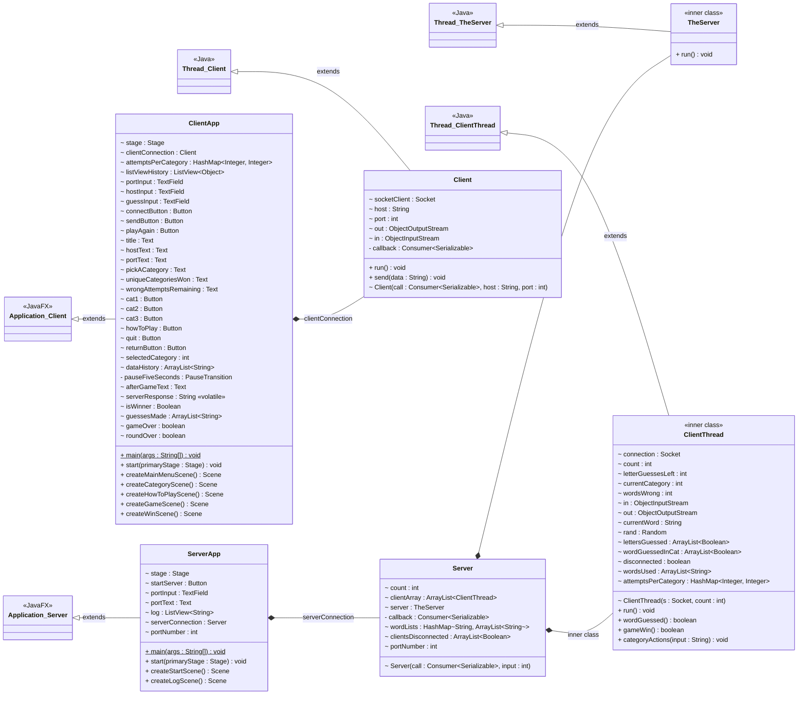

```mermaid
classDiagram
    direction LR

    class Thread_Client {
        <<Java>>
    }
    class Thread_TheServer {
        <<Java>>
    }
    class Thread_ClientThread {
        <<Java>>
    }
    class Application_Client {
        <<JavaFX>>
    }
    class Application_Server {
        <<JavaFX>>
    }

    class Client {
        ~ socketClient : Socket
        ~ host : String
        ~ port : int
        ~ out : ObjectOutputStream
        ~ in : ObjectInputStream
        - callback : Consumer~Serializable~
        + run() void
        + send(data : String) void
        ~ Client(call : Consumer~Serializable~, host : String, port : int)
    }

    class ClientApp {
        ~ stage : Stage
        ~ clientConnection : Client
        ~ attemptsPerCategory : HashMap~Integer, Integer~
        ~ listViewHistory : ListView~Object~
        ~ portInput : TextField
        ~ hostInput : TextField
        ~ guessInput : TextField
        ~ connectButton : Button
        ~ sendButton : Button
        ~ playAgain : Button
        ~ title : Text
        ~ hostText : Text
        ~ portText : Text
        ~ pickACategory : Text
        ~ uniqueCategoriesWon : Text
        ~ wrongAttemptsRemaining : Text
        ~ cat1 : Button
        ~ cat2 : Button
        ~ cat3 : Button
        ~ howToPlay : Button
        ~ quit : Button
        ~ returnButton : Button
        ~ selectedCategory : int
        ~ dataHistory : ArrayList~String~
        - pauseFiveSeconds : PauseTransition
        ~ afterGameText : Text
        ~ serverResponse : String «volatile»
        ~ isWinner : Boolean
        ~ guessesMade : ArrayList~String~
        ~ gameOver : boolean
        ~ roundOver : boolean
        + main(args : String[]) void$
        + start(primaryStage : Stage) void
        + createMainMenuScene() Scene
        + createCategoryScene() Scene
        + createHowToPlayScene() Scene
        + createGameScene() Scene
        + createWinScene() Scene
    }

    class Server {
        ~ count : int
        ~ clientArray : ArrayList~ClientThread~
        ~ server : TheServer
        - callback : Consumer~Serializable~
        ~ wordLists : HashMap~String, ArrayList~String~~
        ~ clientsDisconnected : ArrayList~Boolean~
        ~ portNumber : int
        ~ Server(call : Consumer~Serializable~, input : int)
    }

    class TheServer {
        <<inner class>>
        + run() void
    }

    class ClientThread {
        <<inner class>>
        ~ connection : Socket
        ~ count : int
        ~ letterGuessesLeft : int
        ~ currentCategory : int
        ~ wordsWrong : int
        ~ in : ObjectInputStream
        ~ out : ObjectOutputStream
        ~ currentWord : String
        ~ rand : Random
        ~ lettersGuessed : ArrayList~Boolean~
        ~ wordGuessedInCat : ArrayList~Boolean~
        ~ disconnected : boolean
        ~ wordsUsed : ArrayList~String~
        ~ attemptsPerCategory : HashMap~Integer, Integer~
        ~ ClientThread(s : Socket, count : int)
        + run() void
        + wordGuessed() boolean
        + gameWin() boolean
        + categoryActions(input : String) void
    }

    class ServerApp {
        ~ stage : Stage
        ~ startServer : Button
        ~ portInput : TextField
        ~ portText : Text
        ~ log : ListView~String~
        ~ serverConnection : Server
        ~ portNumber : int
        + main(args : String[]) void$
        + start(primaryStage : Stage) void
        + createStartScene() Scene
        + createLogScene() Scene
    }

    Thread_Client <|-- Client : extends
    Thread_TheServer <|-- TheServer : extends
    Thread_ClientThread <|-- ClientThread : extends
    Application_Client <|-- ClientApp : extends
    Application_Server <|-- ServerApp : extends

    Server *-- TheServer : inner class
    Server *-- ClientThread : inner class

    ClientApp *-- Client : clientConnection
    ServerApp *-- Server : serverConnection
```
